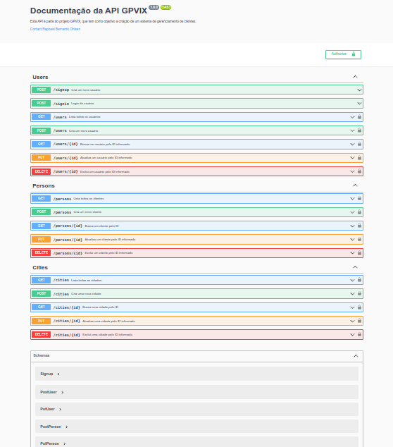
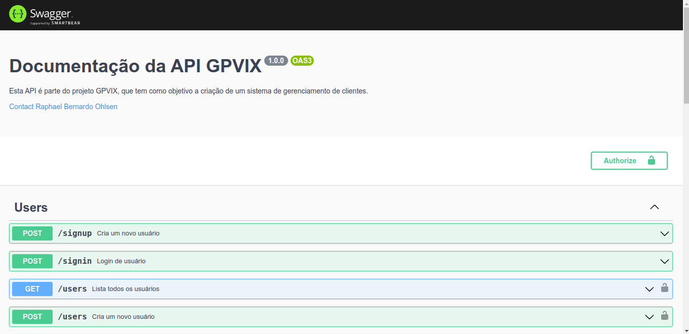
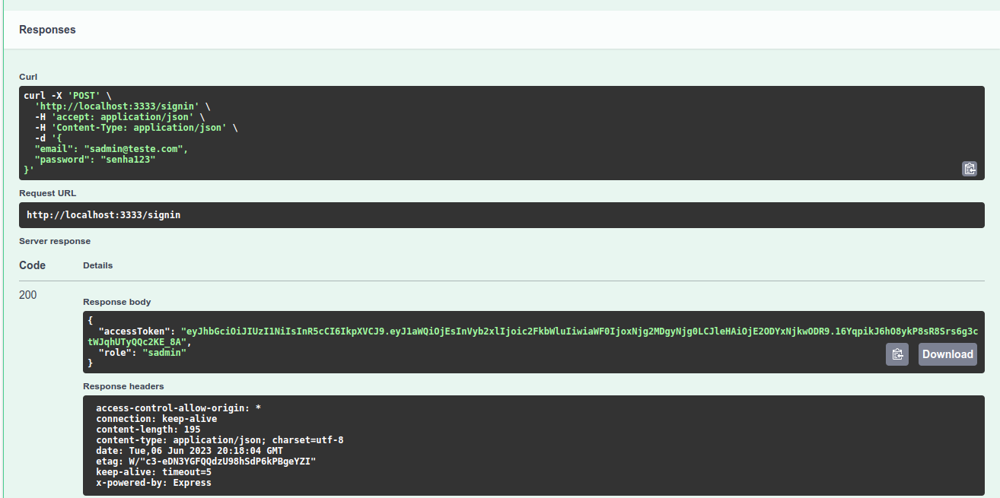
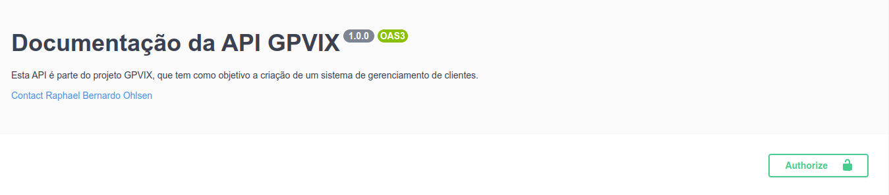

<h1 align="center"> 
	API Rest GPVIX
</h1>
<p align="center">
 <a href="#-sobre-o-projeto">Sobre</a> •
 <a href="#-gpvix">API GPVIX</a> •
 <a href="#-tecnologias">Tecnologias</a> •
 <a href="#-online">Projeto Online</a> •
 <a href="#-install">Instalações</a> •
 <a href="#-env">Arquivo .env</a> •
 <a href="#-database">Banco de Dados</a> •
 <a href="#-swagger">Testando API com Swagger</a> • 
 <a href="#-autor">Autor</a>
</p>

<h1 align="center">
  
</h1>

---

<a id="-sobre-o-projeto"></a>
## 💻 Sobre o projeto

🚀 Neste projeto, foi desenvolvido uma aplicação para cadastro de clientes. Utilizado o Banco de Dados Postgre, JWT e Refresh Token, Kenex.js e diversos outros recursos. O objetivo é aplicar os conhecimentos de backend em uma aplicação para utilização futura em novos projetos tendo este como base. 

&nbsp;

<p align="center">
  <a href="#license"></a>
  <a href="https://github.com/LivioAlvarenga/Template-Api-Rest-Node-Docker-Prisma"></a>
  <a href="https://github.com/LivioAlvarenga/Template-Api-Rest-Node-Docker-Prisma"></a>
<p>

<p align="center">
  <a href= "https://api-rest-node-solid.onrender.com/docs"></a>
<p>


---


<a id="-gpvix"></a>

## 📺 API GPVIX

|  GPVIX |                                                                                                                  |
| --------------------- | ---------------------------------------------------------------------------------------------------------------- |
| :sparkles: Nome       | **API Rest NodeJs**                                                                 |
| :label: Tecnologias   | NodeJs, TypeScript, .ENV, Express, Knex, Yup, PostGre, Jest, Swagger, EsLint, Prettier, Insomnia e JSON Web Token. |                                                                 |
---

<a id="-tecnologias"></a>

## 🛠 Tecnologias

As seguintes ferramentas foram usadas na construção do projeto

&nbsp;

<p align="center">
  <!-- <a href= ""></a> -->
  <a href= "https://nodejs.org/en/" target="_blank" rel="noopener noreferrer"></a>
  <a href= "https://www.typescriptlang.org/" target="_blank" rel="noopener noreferrer"></a>
  <a href= "https://www.dotenv.org/" target="_blank" rel="noopener noreferrer"></a>
  <a href= "https://insomnia.rest/" target="_blank" rel="noopener noreferrer"></a>
  <a href= "https://swagger.io/"></a>
  <a href= "https://jwt.io/"></a>
  <a href= "https://code.visualstudio.com/download" target="_blank" rel="noopener noreferrer"></a>
  <a href= "https://github.com/prettier/prettier" target="_blank" rel="noopener noreferrer"></a>
  <a href= "https://eslint.org/" target="_blank" rel="noopener noreferrer"></a>
</p>

---

<a id="-online"></a>

## 🌐 Projeto Online

A aplicação se encontra em produção e está hospedada na Digital Ocean através deste [link](https://oyster-app-sjykt.ondigitalocean.app/api-docs/). A área de documentação é aberta mas a maioria das rota requer autorização. Caso queira acesso temporário a aplicação entre em [contato](https://mocad.dev/#contato).


---

<a id="-install"></a>

### ⚙️ Instalações

&nbsp;

## Instalando o projeto

```bash
# Clone este repositório
$ git clone https://github.com/RaphaelOhlsen/api-gpvix2.git
```

```bash
# Acesse a pasta do projeto no terminal/cmd
cd api-gpvix2
```
```bash
# Instalação da pasta node_modules
$ yarn install
```
---

<a id="-env"></a>

## 📝 Arquivo .env


Na raiz do projeto renomeie o arquivo *.env.example* para *.env* e abra o arquivo. Neste arquivo temos as seguintes variáveis:

**`PORT`**:  insira o valor na qual a aplicação irá trabalhar em modo de desenvolvimento.

```.env
# Exemplo
PORT=3333
```

**`NODE_ENV`**:  variável usada para indicar o ambiente de execução no qual a aplicação está sendo executada. Vamos trabalhar em ambiente de desenvolvimento.

```.env
# Exemplo
NODE_ENV=development
```

**`IS_LOCALHOST`**:  Preencha com true. Tanto esta varável quanto a varável acima irão inicar o projeto no modo de desenvolvimento. 

```.env
# Exemplo
IS_LOCALHOST=true
```
**`JWT_SECRET`**:  É importante entender que esta variável é usada para garantir a autenticidade e a integridade dos tokens JWT, protegendo a aplicação contra manipulação e falsificação. 
**Recomenda-se armazenar a chave em um local seguro e não compartilhá-la ou expô-la desnecessariamente.** 
Você pode usar o site: [onlinehashtools.com/generate-random-md5-hash](https://onlinehashtools.com/generate-random-md5-hash) para gerar a sua variável.

```.env
# Exemplo
JWT_SECRET=b2e2a8efbdf11a5ed02c9ea76f46082e
```

**`CORS_ORIGIN`**: Esta variável permite definir a lista de domínios (ou URLs) que são permitidos fazer solicitações para a sua aplicação. 
Ao configurar a chave CORS_ORIGIN com um valor específico, você está permitindo que apenas esses domínios tenham acesso aos recursos da sua aplicação através de solicitações CORS. 
Para o nosso exemplo vamos liberar para a [aplicação frontend](https://github.com/RaphaelOhlsen/dashboard-gpvix2) que é parte integrante do nosso projeto. Mas não necessariamente precisamos acessar esta API pela aplicação frontend. Pode ser feita através da documentação Swagger que posteriormente iremos descrever. Exemplo CORS_ORIGIN=http://127.0.0.1:3000

**As demais variáveis são utilizadas em ambiente de produção e não serão comentadas nesta arquivo. Caso tenha interesse pode entrar em [contato](https://mocad.dev/#contato).**

---

<a id="-database"></a>

## 🎲 Banco de Dados

No ambiente de desenvolvimento utilizamos o SQLite. Este banco é um sistema de gerenciamento de banco de dados relacional (SGBDR) que é embutido diretamente em aplicativos. Diferente dos bancos de dados tradicionais, como MySQL ou PostgreSQL, que são executados em um servidor separado, o SQLite opera como uma biblioteca dentro do aplicativo, armazenando os dados em um único arquivo e é muito utilizado em ambientes de teste e desenvolvimento.


```bash
# Instalação do Banco de Dados
$ yarn knex:migrate
```
```bash
# Populando o Banco de Dados
$ yarn knex:seed
```
Em seguida na raiz do projeto podemos verificar o arquivo `database.sqlite` se obtivermos sucesso.

### 📋Tabelas
No banco de dados temos 3 tabelas. São elas:

+ **city**: Encontra-se preenchida com as cidades do meu estado (Espírito Santo).
+ **person**: Tabela onde serão armazenados os dados dos clientes. Possui as colunas `FullName`, `email` e `cityId` que é uma *"chave estrangeira"* (*foreign key*, em inglês). Esta coluna em questão faz referência à chave primária da tabela city, estabelecendo uma relação entre elas.
+ **user**: Tabela onde serão cadastrados as informações dos administradores do sistema. Possui as colunas `mame`, `email`, `password`, `role`. Esta última coluna define os poderes de *autorização de uso* em partes do sistema. Por exemplo, somente usuários com "role" iqual a `sadmin` poderão criar, alterar, atualizar, listar e deletar usuários. Importante informar que para fins de testes o banco de dados já foi populado com o usuário `Sadmin`, que tem as informações de login: `email: sadmin@teste.com`, `password: senha123 `e `role: sadmin`, esta última dá poderes administrativos totais para a aplicação.

---

<a id="-swagger"></a>
## 📄 Testando API com Swagger

Swagger é uma estrutura de código aberto que permite criar, documentar e testar APIs de forma fácil e eficiente. É amplamente utilizado para descrever e documentar APIs RESTful, fornecendo uma representação visual interativa da API.
A principal finalidade do Swagger é melhorar a comunicação entre os desenvolvedores da API e os consumidores da API (como desenvolvedores de aplicativos ou clientes). Com o Swagger, é possível descrever detalhadamente os endpoints da API, os parâmetros necessários, os tipos de dados esperados, as respostas possíveis e até mesmo fornecer exemplos de uso.

### Iniciando a API

```bash
# Inciando a aplicação
$ yarn start
```
Tudo dando certo o pronpt irá retornar a mensagem `Server is running on port 3333`

### Acessando a documentação Swagger
Abra o seu navegador e entre com a seguinte URL localhost:3333/api-docs/

Voce visualizará a seguinte página:

<h1 align="center">
  
</h1>

Para fazer login, clique em `Users - POST /signin`. Na parte direita, clique no botão `Try it out`. Em seguida, no corpo da requisição (Request Body), entre com os dados do usuário Admin (`email: sadmin@teste.com`, `password: senha123`) . Por fim, clique no botão azul `Execute` para prosseguir.

Rolando a tela um pouco abaixo você verá o campo `Responses` como na figura abaixo:

<h1 align="center">
  
</h1>

Copie a informação de accessTokem. 

No início da página do lado direito clique no botão `Authorize` como na figura abaixo:

<h1 align="center">
  
</h1>

Cole a informação de accesToken no campo Value e clique em Authorize e em seguida o botão Close. Agora você poderá usar qualquer rota que requisite autenticação. As rotas que demandam autenticação são sinalizadas com um cadeado na parte direita extrema da rota. 

Agora você pode testar todas as demais rotas, a documentação é auto explicativa e qualquer dúvida entre em [contato](https://mocad.dev/#contato).
 **Divirta-se!!!**

---
<a id="-autor"></a>
## 👨‍💻 Autor
Olá, meu nome é Raphael Ohlsen, Engenheiro de Telecomunicações | BackEnd e FrontEnd Developer. Em transição de carreira de Telecom para Developer que é minha verdadeira paixão. Sou aficcionado por tecnologia e programação. Dúvidas, sugestões e críticas são super bem vindas. Seguem meus contatos.

- [www.mocad.dev](https://mocad.dev)
- [raphael@mocad.dev](raphael@mocad.dev)

<p align="center">Redes Sociais</p>
<p align="center">
  <a href= "https://github.com/RaphaelOhlsen"></a>
  <a href= "https://www.linkedin.com/in/raphael-bernardo-ohlsen-79115689/"></a>
</p>